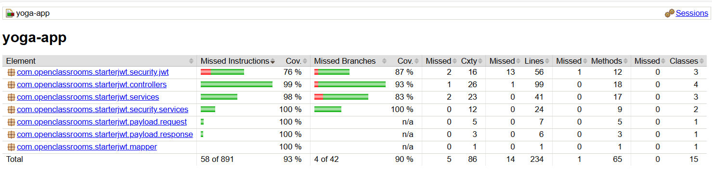
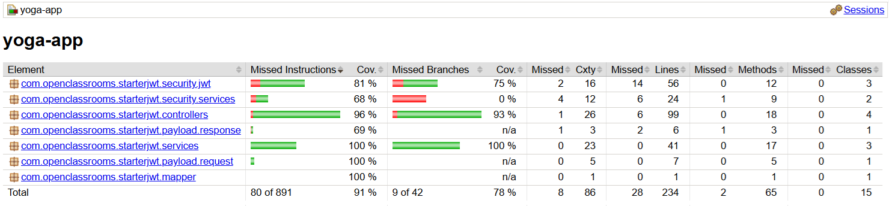

# Yoga App (Back-end)

Back-end API for managing yoga sessions. It handles sessions, users, teachers, and participation, with JWT authentication for secure access.

## Technologies
- Java 21
- Maven
- Spring Boot
- Spring Security + JWT
- Spring Data JPA (Hibernate)
- MySQL
- Lombok
- JUnit 5
- Mockito
- Spring Security Test
- Spring Boot Test
- Failsafe
- Surefire
- Jacoco
- Project developed with IntelliJ IDEA 2025.2

## Configuration
Dans src/main/resources/application.properties :

### MySQL (it must be installed)
The **test** and **testdb** databases must exist. A script to create them is available in ../resources/sql/script.sql
- file **src/main/resources/application.properties** :
spring.datasource.url=jdbc:=jdbc:mysql://localhost:3306/test?allowPublicKeyRetrieval=true        
spring.datasource.username={DB_USER}  
spring.datasource.password={DB_PASSWORD}  
- file **src/test/resources/application.properties** :  
spring.datasource.url=jdbc:=jdbc:mysql://localhost:3306/test?allowPublicKeyRetrieval=true        
spring.datasource.username={DB_USER}  
spring.datasource.password={DB_PASSWORD}

After creating the database using the script, the default admin account is as follows :
login: yoga@studio.com
password: test!1234

## Postman collection
To import the collection into Postman, use the following path : 

ressources/postman/yoga.postman_collection.json

Then, follow the documentation here :

https://learning.postman.com/docs/getting-started/importing-and-exporting-data/#importing-data-into-postman

## Test

To run the unit tests and automatically generate a JaCoCo coverage report, use the command :
> mvn clean test

To run all tests (unit + integration tests) and generate JaCoCo coverage reports, use :
> mvn clean verify

The JaCoCo coverage reports are available in :
- Unit tests : back/target/site/jacoco/index.html

 

- Integration tests : back/target/site/jacoco-it/index.html

